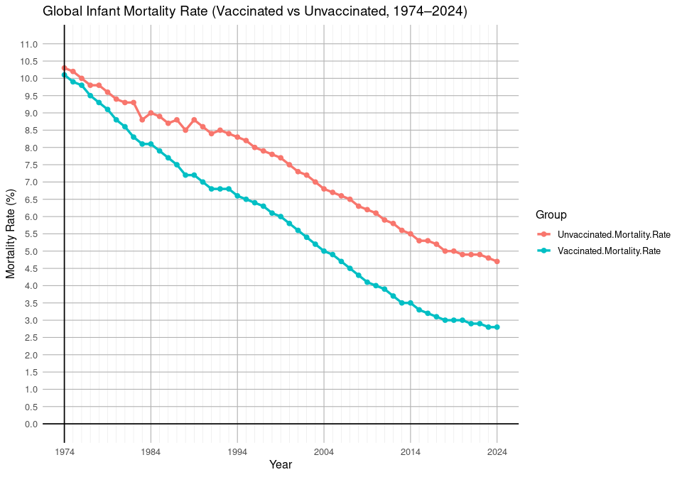
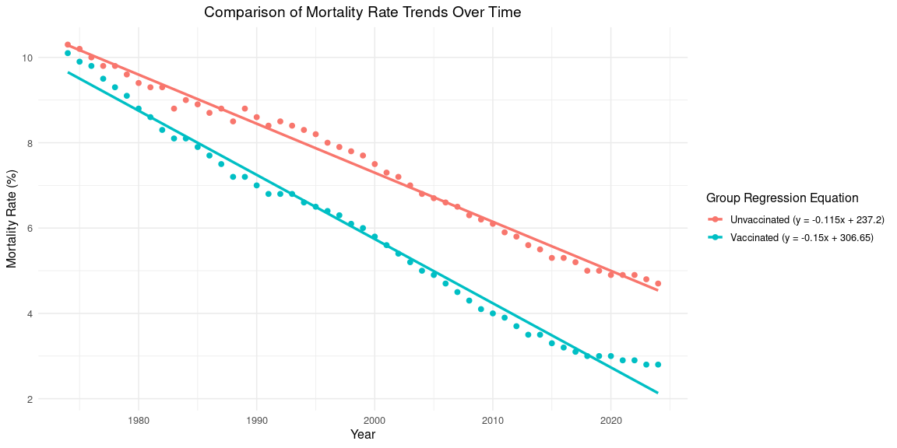

Mortality Rates Compared Between Vaccinated and Unvaccinated Infants
================
Mason Gagner
2025-11-21

- [ABSTRACT](#abstract)
- [BACKGROUND](#background)
- [STUDY QUESTION and HYPOTHESIS](#study-question-and-hypothesis)
  - [Question](#question)
  - [Hypothesis](#hypothesis)
  - [Prediction](#prediction)
- [METHODS](#methods)
  - [First Analysis](#first-analysis)
    - [Comparing Infant Mortality Rates: Line
      Graph](#comparing-infant-mortality-rates-line-graph)
  - [Second Analysis](#second-analysis)
    - [Linear Regression of Vaccinated compared to
      Unvaccinated](#linear-regression-of-vaccinated-compared-to-unvaccinated)
- [DISCUSSION](#discussion)
  - [Interpretation - First Analysis](#interpretation---first-analysis)
  - [Interpretation - Second
    Analysis](#interpretation---second-analysis)
- [CONCLUSION](#conclusion)
- [REFERENCES](#references)

# ABSTRACT

<!--Fill in abstract at the end after we have finished the methods, results, discussion, conclusions and know what our data "says".-->

Infant mortality rate (IMR) serves as a key indicator of population
health and long-term societal progress. This study compares historical
IMR trends between vaccinated and unvaccinated populations from
1974–2024 to evaluate whether vaccines significantly contribute to
greater reductions in infant mortality. A visual comparison of mortality
trajectories over time and a linear regression model assessing the rate
of decline for each group were performed as project analyses. Both
groups showed decreasing IMR across the data’s 50-year period,
consistent with global advancements in healthcare, sanitation, and
living standards. Regression results demonstrated that the vaccinated
group experienced a significantly steeper decline in mortality,
supported by an lm() model in R yielding a p-value of 2.2e-16. These
findings indicate that vaccination is strongly associated with increased
reductions of infant mortality and highlight the long-term
population-level benefits of immunization programs.

# BACKGROUND

<!--Fill in some text here that provides background info on the WNV system, the blood meal DNA extractions, PCR, sequencing, etc. and the foundation for our question/hypothesis.
&#10;NOTE: Examples of data you can plot for the background info at https://github.com/saarman/BIOL3070/ -->

<!--Infant mortality stands as a key indicator of a nation’s overall health and development. Many factors can contribute to the health and life expectancy of people, such as hygiene driven by cultural and technological norms and advancement. Introduction of global vaccination initiatives such as the Expanded Programme on Immunization (EPI) in 1974 has been linked to reductions in preventable childhood deaths (World Health Organization). While there are many studies to confirm the efficacy of vaccines, long-term impact is determined by comparing historical trends of mortality rates.-->

Infant mortality stands as a key indicator of a nation’s overall health
and development. Many factors contribute to early-life survival,
including access to healthcare, hygiene practices driven by cultural and
technological norms, and overall medical advancement. One major global
effort to improve child survival has been the introduction of widespread
vaccination programs. The Expanded Programme on Immunization (EPI),
launched by the World Health Organization in 1974, aimed to reduce
preventable childhood deaths by increasing access to vaccines worldwide
(World Health Organization).

While the effectiveness of vaccines at preventing specific diseases is
well established, the long-term population-level impact is best
understood by examining historical trends in infant mortality rates. IMR
generally reflects deaths per 1,000 live births and provides a broad
picture of overall living conditions. By comparing mortality rates for
vaccinated and unvaccinated populations over time we can evaluate how
strongly vaccination contributes to declines in infant deaths on a
global scale.

# STUDY QUESTION and HYPOTHESIS

## Question

<!--Fill in here, the question we want to answer... e.g. What bird species is acting as WNV amplifying host in Salt Lake City?-->

Between vaccinated and non-vaccinated groups, who shows a more
significant decline in child mortality rates?

## Hypothesis

<!--Fill in hypothesis... e.g. House finches are acting as important amplifying hosts of WNV in Salt Lake City.-->

Infants that are vaccinated will show a more significant decline in
mortality rates compared to those who are unvaccinated.

## Prediction

<!--Fill in prediction... e.g. If house finches are acting as important amplifying hosts, we predict that trapping locations where mosquitoes feed on house finches will also have higher rates of confirmed WNV in tested mosquito pools.-->

If vaccines are effective at reducing mortality rates in infants, we
will see a more significant decline in the mortality for those who are
vaccinated compared to not.

# METHODS

<!--Fill in here, including overview of procedure and methods used for this project.
-->

Two analyses were performed to evaluate the significance of vaccination
on IMR. The first analysis provides a visual assessment of the raw data
for both groups across time. Trends are easily visible using the
1974-2024 data, and the overall difference between the two groups is
established.

The second analysis uses a linear regression model to quantify the rate
of change in mortality for each group. Separate regression models were
fit to the vaccinated and unvaccinated data to calculate their
respective slopes. The calculated slopes represent the year over year
trend. Because our main question focuses on whether the decline in
mortality is significantly different between groups, an interaction
model was used to statistically compare the slopes. A p-value threshold
of α = 0.05 generally offers statistical significance, where the
experimental calculated value fit well within that threshold.

## First Analysis

### Comparing Infant Mortality Rates: Line Graph

``` r
library(ggplot2)
library(tidyr)

data <- read.csv("Globalinfantmortalityrate.csv")

# Change the formatting for graph type
data_long <- pivot_longer(data,
                          cols = c("Vaccinated.Mortality.Rate", "Unvaccinated.Mortality.Rate"),
                          names_to = "Group",
                          values_to = "MortalityRate")

# Creating the plot
ggplot(data_long, aes(x = Year, y = MortalityRate, color = Group)) +
  geom_line(size = 1.2) +
  geom_point(size = 2) +
  
  # Solid Axis Lines and line spacing
  geom_hline(yintercept = 0, color = "black", size = 0.6) +
  geom_vline(xintercept = min(data_long$Year), color = "black", size = 0.6) +
  
  scale_y_continuous(
    limits = c(0, 11),
    breaks = seq(0, 11, by = 0.5),   
    minor_breaks = NULL              
  ) +
  scale_x_continuous(
    breaks = seq(min(data_long$Year), max(data_long$Year), by = 10),  
    minor_breaks = data_long$Year                                     
  ) +
  
  # Line colors for the faded/more solid colored lines: AI used to assist in formatting.
  theme_minimal(base_size = 12) +
  theme(
    panel.grid.minor = element_line(color = "gray90", size = 0.2),
    panel.grid.major = element_line(color = "gray70", size = 0.4),   
    panel.border = element_blank(),                                  
    axis.line = element_blank()                                      
  ) +
  
  labs(
    title = "Global Infant Mortality Rate (Vaccinated vs Unvaccinated, 1974–2024)",
    x = "Year",
    y = "Mortality Rate (%)",
    color = "Group"
  )
```



## Second Analysis

### Linear Regression of Vaccinated compared to Unvaccinated

``` r
data <- read.csv("Globalinfantmortalityrate.csv")

# Slope for Vaccinated
model_vax <- lm(Vaccinated.Mortality.Rate ~ Year, data = data)

# Slope for Unvaccinated
model_unvax <- lm(Unvaccinated.Mortality.Rate ~ Year, data = data)

summary(model_vax)$coefficients
```

    ##                Estimate  Std. Error   t value     Pr(>|t|)
    ## (Intercept) 306.6466817 4.634064296  66.17230 1.365245e-49
    ## Year         -0.1504525 0.002318128 -64.90257 3.491021e-49

``` r
summary(model_unvax)$coefficients
```

    ##                Estimate  Std. Error   t value     Pr(>|t|)
    ## (Intercept) 237.1972670 3.461198948  68.53038 2.499673e-50
    ## Year         -0.1149502 0.001731418 -66.39079 1.163643e-49

``` r
slope_vax <- coef(model_vax)[2]
slope_unvax <- coef(model_unvax)[2]

cat("Vaccinated slope:", slope_vax, "\n")
```

    ## Vaccinated slope: -0.1504525

``` r
cat("Unvaccinated slope:", slope_unvax, "\n")
```

    ## Unvaccinated slope: -0.1149502

``` r
#If the p-value for that term is < 0.05, the slopes are significantly different.
#If the p-value is > 0.05, the slopes are not significantly different.

# Reshape the data
data_long <- data.frame(
  Year = rep(data$Year, 2),
  Mortality = c(data$Vaccinated.Mortality.Rate, data$Unvaccinated.Mortality.Rate),
  Group = rep(c("Vaccinated", "Unvaccinated"), each = nrow(data))
)
model <- lm(Mortality ~ Year * Group, data = data_long)
summary(model)
```

    ## 
    ## Call:
    ## lm(formula = Mortality ~ Year * Group, data = data_long)
    ## 
    ## Residuals:
    ##      Min       1Q   Median       3Q      Max 
    ## -0.45097 -0.14736 -0.04261  0.12860  0.66916 
    ## 
    ## Coefficients:
    ##                        Estimate Std. Error t value Pr(>|t|)    
    ## (Intercept)          237.197267   4.089893   58.00   <2e-16 ***
    ## Year                  -0.114950   0.002046  -56.19   <2e-16 ***
    ## GroupVaccinated       69.449415   5.783982   12.01   <2e-16 ***
    ## Year:GroupVaccinated  -0.035502   0.002893  -12.27   <2e-16 ***
    ## ---
    ## Signif. codes:  0 '***' 0.001 '**' 0.01 '*' 0.05 '.' 0.1 ' ' 1
    ## 
    ## Residual standard error: 0.2151 on 98 degrees of freedom
    ## Multiple R-squared:  0.9901, Adjusted R-squared:  0.9898 
    ## F-statistic:  3279 on 3 and 98 DF,  p-value: < 2.2e-16

``` r
library(ggplot2)
library(dplyr)
```

    ## 
    ## Attaching package: 'dplyr'

    ## The following objects are masked from 'package:stats':
    ## 
    ##     filter, lag

    ## The following objects are masked from 'package:base':
    ## 
    ##     intersect, setdiff, setequal, union

``` r
# Calculate slope and intercept for each group
equations <- data_long %>%
  group_by(Group) %>%
  do(model = lm(Mortality ~ Year, data = .)) %>%
  summarize(
    Group,
    Intercept = coef(model)[1],
    Slope = coef(model)[2]
  )

# Clean up group names and make equation labels
equations <- equations %>%
  mutate(
    Group = recode(Group,
                   "Vaccinated.Mortality.Rate" = "Vaccinated",
                   "Unvaccinated.Mortality.Rate" = "Unvaccinated"),
    label = paste0(Group, " (y = ",
                   round(Slope, 3), "x + ",
                   round(Intercept, 2), ")")
  )

# Merge labels back into main dataset
data_long_labeled <- data_long %>%
  left_join(equations, by = "Group")

# Plot design: AI was used to assist in the incorporation of the slope onto the graph. 
ggplot(data_long_labeled, aes(x = Year, y = Mortality, color = label)) +
  geom_point(size = 2) +
  geom_smooth(method = "lm", se = FALSE, lwd = 1.2) +
  theme_minimal(base_size = 12) +
  theme(
    plot.title = element_text(hjust = 0.5)  # centers the title
  ) +
  labs(
    title = "Comparison of Mortality Rate Trends Over Time",
    y = "Mortality Rate (%)",
    x = "Year",
    color = "Group Regression Equation"
  )
```

    ## `geom_smooth()` using formula = 'y ~ x'

<!-- -->

# DISCUSSION

## Interpretation - First Analysis

This representation of the data (Shattock et al. 2024) provides a clear
visual of the long term historical trends of mortality rate. It is
clearly visible that both groups in the study experienced a decrease in
overall mortality rate. The decline can be attributed to the overall
increase in living conditions and standards. Progression in hygiene and
health are applicable to both groups, so assesing the difference between
the changes is necessary to understanding the significance, if any, of
the impact of vaccines.

## Interpretation - Second Analysis

Using the slopes of the lines allows for a statistical analysis to be
performed. The unvaccinated line had a slope of -0.11 where vaccinated
was -0.15. While improvement for both is good, running a t-test for two
slopes allows for statistical significance to be determined. Using the
lm() function in R, the two regression lines were compared and a p-value
of 2.2e-16 was generated. With the standard scientifically accepted
p-value of significance being p \< 0.05, the data suggests that there is
a rather significant difference in the slopes from the two groups.

# CONCLUSION

The analyses done in this study provided clear evidence that there is a
statistical significance to the rate of decline of infant mortality
since 1974 for vaccinated and unvaccinated groups. While both showed
decrease from confounding factors of technological and health
advancements, the vaccinated group showed a statistically significantly
steeper decline. Random variation can be excused due to the calculated
p-value of 2.2e-16.

These findings support the original study hypothesis of vaccines
contributing in a significant manner to the decline in infant mortality
rates. Long-term population-level benefits of immunization programs is
displayed from this study and reinforces the importance of vaccines.

# REFERENCES

OpenAI. (2025). ChatGPT (Oct 2025 version) \[Large language model\].
OpenAI. <https://chat.openai.com/> (Used for general structuring and
grammatical checking)

Shattock et al. (2024). Contribution of vaccination to improved survival
and health: modelling 50 years of the Expanded Programme on
Immunization. – processed by Our World in Data. “Global infant mortality
rate with and without vaccines” \[dataset\]. Shattock et al. (2024).
Contribution of vaccination to improved survival and health: modelling
50 years of the Expanded Programme on Immunization.,
“infant_mortality_vaccination_shattock” \[original data\]. Retrieved
October 28, 2025 from
<https://archive.ourworldindata.org/20250909-093708/grapher/infant-mortality-vaccines.html>
(archived on September 9, 2025).

World Health Organization. (n.d.). Essential Programme on immunization.
World Health Organization.
<https://www.who.int/teams/immunization-vaccines-and-biologicals/essential-programme-on-immunization>
