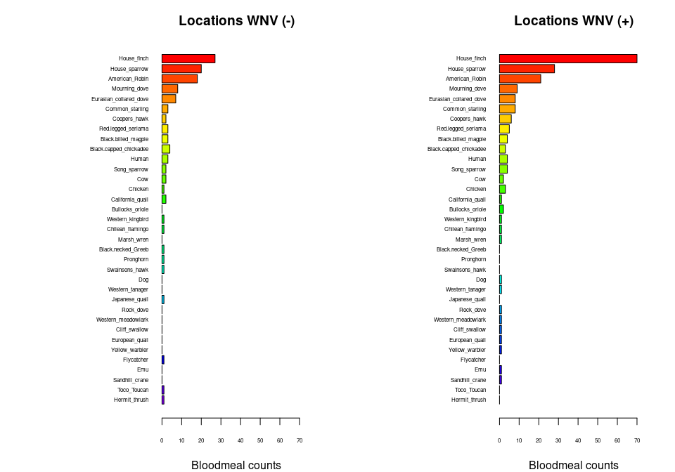

Warm-up mini-Report: Mosquito Blood Hosts in Salt Lake City, Utah
================
Mason Gagner
2025-10-09

- [ABSTRACT](#abstract)
- [BACKGROUND](#background)
- [STUDY QUESTION and HYPOTHESIS](#study-question-and-hypothesis)
  - [Questions](#questions)
  - [Hypothesis](#hypothesis)
  - [Prediction](#prediction)
- [METHODS](#methods)
  - [First Analysis](#first-analysis)
    - [Barplots of blood meal ID by trap locations with/without WNV
      positive mosquito
      pools](#barplots-of-blood-meal-id-by-trap-locations-withwithout-wnv-positive-mosquito-pools)
  - [Second Analysis](#second-analysis)
    - [GLM: Generalized Linear
      Modeling](#glm-generalized-linear-modeling)
- [DISCUSSION](#discussion)
  - [Interpretation - Barplots](#interpretation---barplots)
  - [Interpretation - GLM](#interpretation---glm)
- [CONCLUSION](#conclusion)
- [REFERENCES](#references)

# ABSTRACT

<!--Fill in abstract at the end after we have finished the methods, results, discussion, conclusions and know what our data "says".-->

West Nile Virus (WNV) is maintained in transmission cycles between avian
species and mosquitos with certain bird species acting as key amplifying
hosts over others. Mosquito blood meal hosts were investigated by way of
traps collecting mosquito samples in various locations across Salt Lake
City. Sites were compared that were WNV-positive and WNV-negative. House
Finches (Haemorhous mexicanus) were among the most common hosts and
their presence was strongly correlated with WNV-positive sites. GLM
further demonstrated a positive correlation between House Finch blood
meals and local WNV positive rates. These findings support the
hypothesis that House Finches disproportionately contribute to WNV
amplification. Understanding host-specific blood feeding patterns by
mosquitos can improve surveillance and management of WNV transmission
risk.

# BACKGROUND

<!--Fill in some text here that provides background info on the WNV system, the blood meal DNA extractions, PCR, sequencing, etc. and the foundation for our question/hypothesis.
&#10;For example, we can use the viremia duration (Komar et al., 2003) bar plot (make sure to reference sources!!!)  to illustrate the potential importance of house finches in WNV transmission and as the logical foundation for our hypothesis that house finches serve as amplifying hosts for WNV... and the prediction that locations with more house finches in our blood host analysis are also the same locations with higher positive tests for WNV in mosquito pools... 
&#10;NOTE: Examples of data you can plot for the background info at https://github.com/saarman/BIOL3070/ -->

West Nile Virus (WNV) is transmitted via mosquito bites. Only around 20%
of individuals exhibit signs of the virus when infected. Symptoms can
include fever, headache, body aches, or other flu-like symptoms
(Cleveland Clinic, 2025). The virus is maintained in nature by a cycle
of mosquito bites transferring WNV from reservoir host species . Through
research, birds have been determined to be a rather large contributor to
the maintenance of WNV and its spread. House Finches (Haemorhous
mexicanus) are notable host reservoirs of the virus given their
prolonged and high-titer of the virus (Komar et al., 2003). With the
data sample, prominent species in WNV transmission and living reservoir
information will be used to determine what bird species are acting as
the largest amplifying reservoir host species.

``` r
# Manually transcribe duration (mean, lo, hi) from the last table column
duration <- data.frame(
  Bird = c("Canada Goose","Mallard", 
           "American Kestrel","Northern Bobwhite",
           "Japanese Quail","Ring-necked Pheasant",
           "American Coot","Killdeer",
           "Ring-billed Gull","Mourning Dove",
           "Rock Dove","Monk Parakeet",
           "Budgerigar","Great Horned Owl",
           "Northern Flicker","Blue Jay",
           "Black-billed Magpie","American Crow",
           "Fish Crow","American Robin",
           "European Starling","Red-winged Blackbird",
           "Common Grackle","House Finch","House Sparrow"),
  mean = c(4.0,4.0,4.5,4.0,1.3,3.7,4.0,4.5,5.5,3.7,3.2,2.7,1.7,6.0,4.0,
           4.0,5.0,3.8,5.0,4.5,3.2,3.0,3.3,6.0,4.5),
  lo   = c(3,4,4,3,0,3,4,4,4,3,3,1,0,6,3,
           3,5,3,4,4,3,3,3,5,2),
  hi   = c(5,4,5,5,4,4,4,5,7,4,4,4,4,6,5,
           5,5,5,7,5,4,3,4,7,6)
)

# Choose some colors
cols <- c(rainbow(30)[c(10:29,1:5)])  # rainbow colors

# horizontal barplot
par(mar=c(5,12,2,2))  # wider left margin for names
bp <- barplot(duration$mean, horiz=TRUE, names.arg=duration$Bird,
              las=1, col=cols, xlab="Days of detectable viremia", xlim=c(0,7))

# add error bars
arrows(duration$lo, bp, duration$hi, bp,
       angle=90, code=3, length=0.05, col="black", xpd=TRUE)
```


(Komar et al., 2003)

# STUDY QUESTION and HYPOTHESIS

## Questions

<!--Fill in here, the question we want to answer... e.g. What bird species is acting as WNV amplifying host in Salt Lake City?-->

What bird species are acting as the largest amplifying reservoir host
species?

## Hypothesis

<!--Fill in hypothesis... e.g. House finches are acting as important amplifying hosts of WNV in Salt Lake City.-->

House finches are disproportionately contributing to the spread of WNV
as amplifying hosts in Salt Lake City.

## Prediction

<!--Fill in prediction... e.g. If house finches are acting as important amplifying hosts, we predict that trapping locations where mosquitoes feed on house finches will also have higher rates of confirmed WNV in tested mosquito pools.-->

If house finches are largely important amplifying hosts of WNV, we
predict that locations where mosquitos have been feeding on house
finches will have a higher rate of confirmed WNV when compared to other
areas where other species are fed on.

# METHODS

<!--Fill in here, including overview of procedure and methods used for this project.
&#10;To connect real-world-transmission data to laboratory findings, molecular tools are used. Polymerase chain reaction (PCR) is a method of DNA amplification used to determine what host species mosquitos have blood fed on by extracting the blood from the mosquito and sequencing the amplified DNA fragments. Primers are used in the amplification to make many copies of the DNA strands for better reading (Polymerase Chain Reaction (PCR), n.d.). Identifying the host correctly allows for connections to be made to determine feeding patterns and infection outcomes.
&#10;-->

Mosquitoes were trapped from several locations in Salt Lake City.
Bloodmeal DNA was taken from flood-fed mosquitoes and analyzed using PCR
to identify what host species the mosquito had fed on. Depending on
whether the mosquito pools tested positive for West Nile Virus, the
sites were determined to be WNV-positive or negative. To compare host
use between these two groups, bloodmeal counts were added up for each
species and displayed in barplots. This showed which bird species
mosquitoes fed on the most at positive and negative sites. To further
investigate whether House Finches were desproportionally linked to
WNV-positive areas, two generalized linear models (GLM) were run. One
GLM tested if House Finch bloodmeals predicted whether a site was
positive or negative, while another tested if House Finch bloodmeals
predicted the positivity rate of a site.

## First Analysis

### Barplots of blood meal ID by trap locations with/without WNV positive mosquito pools

Horizontal plots:

``` r
## import counts_matrix: data.frame with column 'loc_positives' (0/1) and host columns 'host_*'
counts_matrix <- read.csv("./bloodmeal_plusWNV_for_BIOL3070.csv")

## 1) Identify host columns
host_cols <- grep("^host_", names(counts_matrix), value = TRUE)

if (length(host_cols) == 0) {
  stop("No columns matching '^host_' were found in counts_matrix.")
}

## 2) Ensure loc_positives is present and has both levels 0 and 1 where possible
counts_matrix$loc_positives <- factor(counts_matrix$loc_positives, levels = c(0, 1))

## 3) Aggregate host counts by loc_positives
agg <- stats::aggregate(
  counts_matrix[, host_cols, drop = FALSE],
  by = list(loc_positives = counts_matrix$loc_positives),
  FUN = function(x) sum(as.numeric(x), na.rm = TRUE)
)

## make sure both rows exist; if one is missing, add a zero row
need_levels <- setdiff(levels(counts_matrix$loc_positives), as.character(agg$loc_positives))
if (length(need_levels)) {
  zero_row <- as.list(rep(0, length(host_cols)))
  names(zero_row) <- host_cols
  for (lv in need_levels) {
    agg <- rbind(agg, c(lv, zero_row))
  }
  ## restore proper type
  agg$loc_positives <- factor(agg$loc_positives, levels = c("0","1"))
  ## coerce numeric host cols (they may have become character after rbind)
  for (hc in host_cols) agg[[hc]] <- as.numeric(agg[[hc]])
  agg <- agg[order(agg$loc_positives), , drop = FALSE]
}

## 4) Decide species order (overall abundance, descending)
overall <- colSums(agg[, host_cols, drop = FALSE], na.rm = TRUE)
host_order <- names(sort(overall, decreasing = TRUE))
species_labels <- rev(sub("^host_", "", host_order))  # nicer labels

## 5) Build count vectors for each panel in the SAME order
counts0 <- rev(as.numeric(agg[agg$loc_positives == 0, host_order, drop = TRUE]))
counts1 <- rev(as.numeric(agg[agg$loc_positives == 1, host_order, drop = TRUE]))

## 6) Colors: reuse your existing 'cols' if it exists and is long enough; otherwise generate
if (exists("cols") && length(cols) >= length(host_order)) {
  species_colors <- setNames(cols[seq_along(host_order)], species_labels)
} else {
  species_colors <- setNames(rainbow(length(host_order) + 10)[seq_along(host_order)], species_labels)
}

## 7) Shared x-limit for comparability
xmax <- max(c(counts0, counts1), na.rm = TRUE)
xmax <- if (is.finite(xmax)) xmax else 1
xlim_use <- c(0, xmax * 1.08)

## 8) Plot: two horizontal barplots with identical order and colors
op <- par(mfrow = c(1, 2),
          mar = c(4, 12, 3, 2),  # big left margin for species names
          xaxs = "i")           # a bit tighter axis padding

## Panel A: No WNV detected (loc_positives = 0)
barplot(height = counts0,
        names.arg = species_labels, 
        cex.names = .5,
        cex.axis = .5,
        col = rev(unname(species_colors[species_labels])),
        horiz = TRUE,
        las = 1,
        xlab = "Bloodmeal counts",
        main = "Locations WNV (-)",
        xlim = xlim_use)

## Panel B: WNV detected (loc_positives = 1)
barplot(height = counts1,
        names.arg = species_labels, 
        cex.names = .5,
        cex.axis = .5,
        col = rev(unname(species_colors[species_labels])),
        horiz = TRUE,
        las = 1,
        xlab = "Bloodmeal counts",
        main = "Locations WNV (+)",
        xlim = xlim_use)
```



``` r
par(op)

## Keep the colors mapping for reuse elsewhere
host_species_colors <- species_colors
```

## Second Analysis

### GLM: Generalized Linear Modeling

House finch GLM:

Does house finch have an effect by location positive +/- (binary)? by
location positivity rate?

``` r
#glm with house finch alone against binary +/_
glm1 <- glm(loc_positives ~ host_House_finch,
            data = counts_matrix,
            family = binomial)
summary(glm1)
```

    ## 
    ## Call:
    ## glm(formula = loc_positives ~ host_House_finch, family = binomial, 
    ##     data = counts_matrix)
    ## 
    ## Coefficients:
    ##                  Estimate Std. Error z value Pr(>|z|)  
    ## (Intercept)       -0.1709     0.1053  -1.622   0.1047  
    ## host_House_finch   0.3468     0.1586   2.187   0.0287 *
    ## ---
    ## Signif. codes:  0 '***' 0.001 '**' 0.01 '*' 0.05 '.' 0.1 ' ' 1
    ## 
    ## (Dispersion parameter for binomial family taken to be 1)
    ## 
    ##     Null deviance: 546.67  on 394  degrees of freedom
    ## Residual deviance: 539.69  on 393  degrees of freedom
    ## AIC: 543.69
    ## 
    ## Number of Fisher Scoring iterations: 4

``` r
#glm with house-finch alone against positivity rate
glm2 <- glm(loc_rate ~ host_House_finch,
            data = counts_matrix)
summary(glm2)
```

    ## 
    ## Call:
    ## glm(formula = loc_rate ~ host_House_finch, data = counts_matrix)
    ## 
    ## Coefficients:
    ##                  Estimate Std. Error t value Pr(>|t|)    
    ## (Intercept)      0.054861   0.006755   8.122 6.07e-15 ***
    ## host_House_finch 0.027479   0.006662   4.125 4.54e-05 ***
    ## ---
    ## Signif. codes:  0 '***' 0.001 '**' 0.01 '*' 0.05 '.' 0.1 ' ' 1
    ## 
    ## (Dispersion parameter for gaussian family taken to be 0.01689032)
    ## 
    ##     Null deviance: 6.8915  on 392  degrees of freedom
    ## Residual deviance: 6.6041  on 391  degrees of freedom
    ##   (2 observations deleted due to missingness)
    ## AIC: -484.56
    ## 
    ## Number of Fisher Scoring iterations: 2

Answer: YES. Statistically significant association.

# DISCUSSION

Our data produced results that support the original hypothesis of House
Finches serve as key amplifying hosts for WNV in Salt Lake City.
Analysis of the barplot illustrated their high prominence across
mosquito blood meals, and the GLM confirmed that their presence is
statistically linked with WNV-positive sites. These findings align with
controlled experimental infections demonstrating that House Finches
sustain high and prolonged viremia (Komar et al., 2003), making them
incredibly efficient live reservoirs.

Many other species were also represented in the dataset, which is
consistent with the data of multiple species carrying the virus.
However, the stronger association with House Finches emphasizes their
importance in local transmission dynamics.

A limitation of this study would be reliance on pooled trap data rather
than individual-level infection outcomes. Future work could include
individual level testing based on where the trap was (individual results
categorized by location would allow for more data in regards to
proportion to be determined but would be incredibly expensive) and
integrate abundance surveys to determine bird species populations in
each area.

## Interpretation - Barplots

The barplots comparing host blood meals between WNV-positive and
WNV-negative sites show that mosquitoes frequently fed on a range of
avian species. However, House Finches appeared consistently among the
top species in both categories, with notably higher representation at
WNV-positive sites. This pattern suggests that House Finch blood meals
may be associated with increased local WNV detection compared to other
hosts.

## Interpretation - GLM

The GLM testing the association between House Finch blood meals and WNV
positivity produced a statistically significant effect (p \< 0.05).
Specifically, sites with higher numbers of House Finch feedings were
more likely to test positive for WNV. A second GLM indicated that the
number of House Finch blood meals was positively correlated with the
local WNV positivity rate (p \< 0.001). Together, this suggests that
House Finches disproportionately contribute to the amplification of WNV
relative to other hosts.

# CONCLUSION

The data from this study demonstrates that House Finches are
disproportionately associated with WNV-positive mosquito pools in Salt
Lake City. Both descriptive (barplots) and statistical (GLM) analyses
indicate their central role as amplifying living reservoirs of WNV.
Interpretations of this would justify an observance of the finch
population as well as mosquito population to assist in determining the
transmission of WNV.

# REFERENCES

Cleveland Clinic. (2025, September 12). What is West Nile virus?
Cleveland Clinic.
<https://my.clevelandclinic.org/health/diseases/10939-west-nile-virus>

Komar, N., Langevin, S., Hinten, S., Nemeth, N., Edwards, E., Hettler,
D., Davis, B., Bowen, R., & Bunning, M. (2003). Experimental infection
of North American birds with the New York 1999 strain of West Nile
virus. Emerging Infectious Diseases, 9(3), 311–322.
<https://doi.org/10.3201/eid0903.020628>

National Human Genome Research Institute. (n.d.). Polymerase chain
reaction (PCR). Genome.gov.
<https://www.genome.gov/genetics-glossary/Polymerase-Chain-Reaction-PCR>

OpenAI. (2025). ChatGPT (Sep 2025 version) \[Large language model\].
OpenAI. <https://chat.openai.com/> (Used for general structuring and
grammatical checking)
